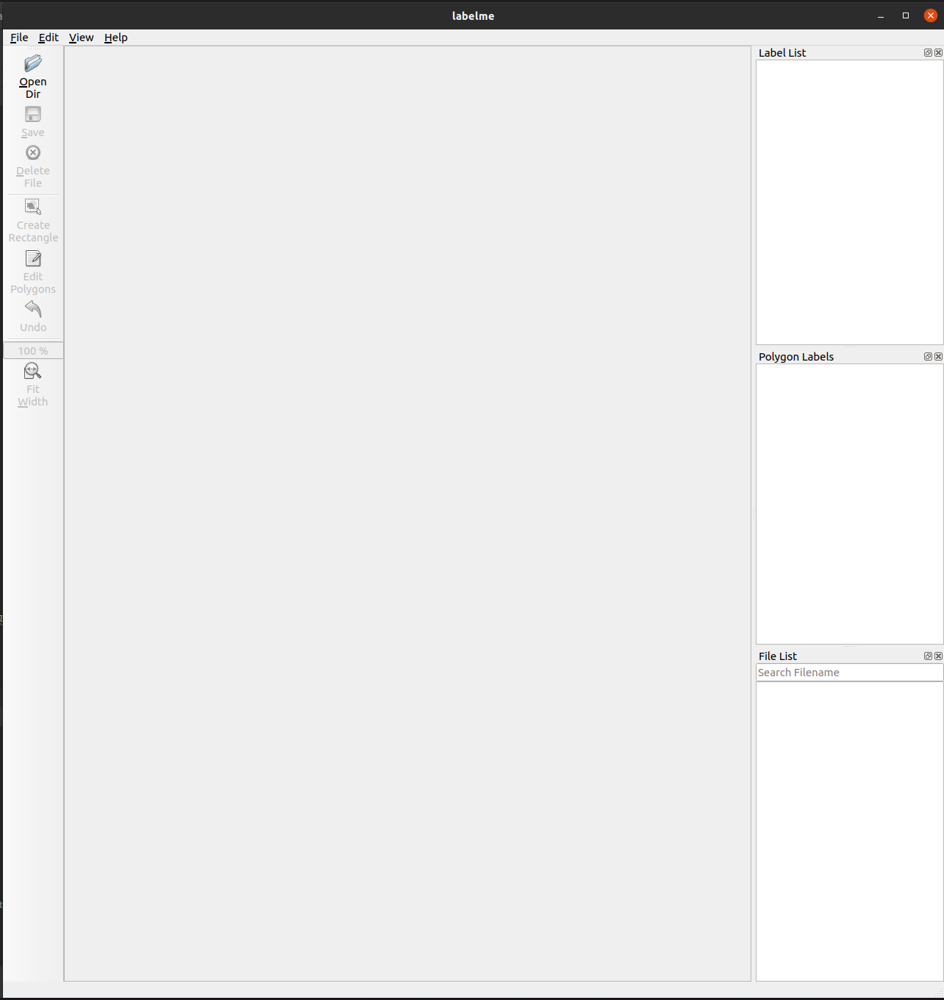

仏顔のアノテーションのやり方
=========================

目的
=======

このアノテーションでは、仏像の顔のランドマーク点（顔輪郭目鼻口など）の自動抽出のためのデータを作成していただきます。同じ仏像に対して、何枚かの画像でランドマーク点をつけることで、3次元の点の位置を求めることができるようになります。顔を囲む矩形を与えることでランドマーク点の大体の位置が与えられますが、この大体の位置から一番適切と思われる位置に修正してください。

設定とソフトウェアの起動方法
=======

まずは、アノテーションに利用するソフトウェアを準備します。

https://drive.google.com/drive/folders/1Zz4YJfn-WtoTnjCfWkFR4U6e9q7yckBs?usp=sharing

`buddha_face_annotation2`フォルダをダウンロードして、適当な場所に保存してください。ファルダ内に、`data.zip`というファイルがあります。Windowsユーザは右クリックして「ここに解凍」を選択、Macユーザはダブルクリックすると解凍されます。また、上記のGoogleDrive内には、それぞれの名前のフォルダがあります。アノテーションの結果は、それぞれの名前のフォルダに保存していただきます。

アノテーションに利用するソフトウェアは以下の方法で起動します。

-   Windowsの場合:
        
    1.  `buddha_faces_annotation`のフォルダ内の`WINDOWSlabelme.bat`をダブルクリックします。
        
    1.  初回起動時、キーボードの[y]とエンターキーを順番に押すように求められることがあります。その場合は、画面の指示に従ってください。

-   Macの場合:

    1.  `buddha_faces_annotation`のフォルダ内の`MACOSXlabelme.command`をダブルクリックします。
        
    1.  初回起動時、キーボードの[y]とエンターキーを順番に押すように求められることがあります。その場合は、画面の指示に従ってください。

上記手順で、アノテーションで使うソフトウェアのウインドウが表示されます。フルスクリーンにすると操作がしやすいです。

これで準備、起動完了です。

アノテーション方法
===============

アノテーションを開始するには、「Open Dir」ボタンをクリックして、ダイアログウインドウで対象のデータを指定します。対象となるデータは、`shard_XX`のフォルダにあり、それぞれ仏像100体分のデータが含まれています。アノテーション作業は、このフォルダ(Shardと呼びます)単位で取り組んでいただきます。新しいShardのアノテーションを始めるときは、他の人とかぶらないように、下記のGoogleDrive上のShardトラッキングのファイルで、対応する行にご自身の名前を記入してください。

https://drive.google.com/drive/folders/1Zz4YJfn-WtoTnjCfWkFR4U6e9q7yckBs?usp=sharing

**他の人がすでにアノテーションを始めたShardにアノテーション作業をしないように、注意してください。**

ShardトラッキングでShardを確保したら、そのフォルダを開きます。すると、`artifact_XXXX`のようなフォルダがあります。このそれぞれが、仏像1体に対応します。Shardに含まれるすべての仏像にアノテーションを付けてください。アノテーション対象のフォルダ（`artifact_XXX`）を選んだら、「Select folder」ボタンを押します。

すると、右下の「File List」のパネルに画像のファイル名が表示されます。ファイル名をクリックすると画像が読み込まれます。

すると、以前にアノテーションをしてもらった結果が表示されます。

​今回は、2次元の点をアノテーションします。このため、画像中の仏像では見えないと考えられるランドマーク点は表示されないようになっています。

画像中のランドマーク点をクリックすると、そのランドマーク点が選択され、ドラッグすると自由に動かせます。適切と思われる位置に合わせてください。色がついた領域を選択すると、その領域を囲むすべての点を同時に動かせます。新しいランドマーク点を追加する必要はありません。表示されたランドマーク点を移動させてください。`Ctrl`+マウスホイールで画像を拡大縮小できます。変更を取り消す場合は`Ctrl`+`z`を利用してください。他の画像を読み込まない限り、変更を取り消すことができます。

**今回は、ランドマーク点は2次元の点として記録されます。ある画像上での編集は他の画像には影響を与えませんので、各画像で1回ずつアノテーションで来たらOKです。**

Shardの作業が終わったら
=================================

一つの仏像のすべての画像に対してランドマーク点の修正が完了したら、「Open Dir」ボタンでShard内の次の仏像の作業に移ります。

作業結果の保存は自動的にされていますが、アノテーション用のソフトウェアを閉じる際には、ランドマーク点を少しだけ動かすなどして、直前の作業が確実に保存されるよう注意してください。

Shard内のすべての画像に対して作業が完了したら、そのShardに対応するフォルダを、下記のGoogleDrive上の`annotations2`の中のご自身の名前のフォルダ内にドラッグ＆ドロップしてアップロードしてください。

https://drive.google.com/drive/folders/1Zz4YJfn-WtoTnjCfWkFR4U6e9q7yckBs?usp=sharing

​
その後、新しいShardを取得（Shardトラッキングに名前を入力）して、アノテーションを続けて下さい。

ご協力ありがとうございます 😃

Hugo
