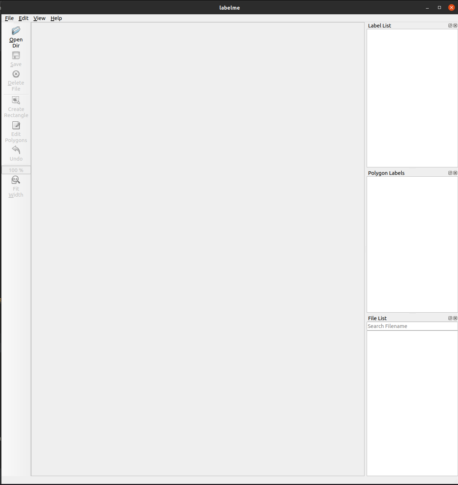
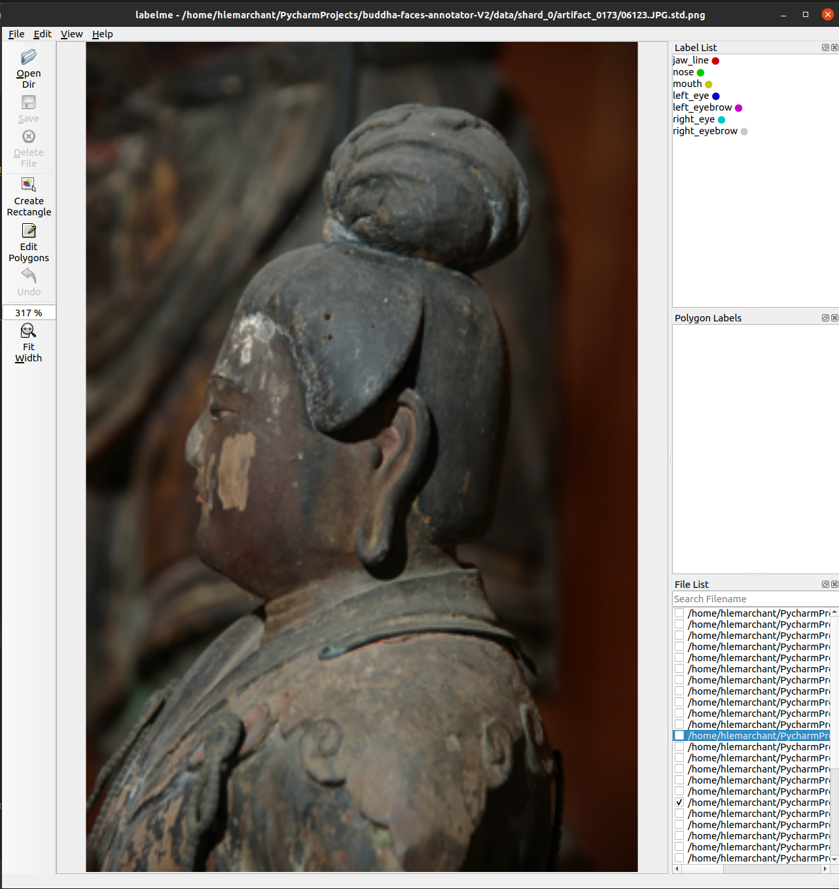
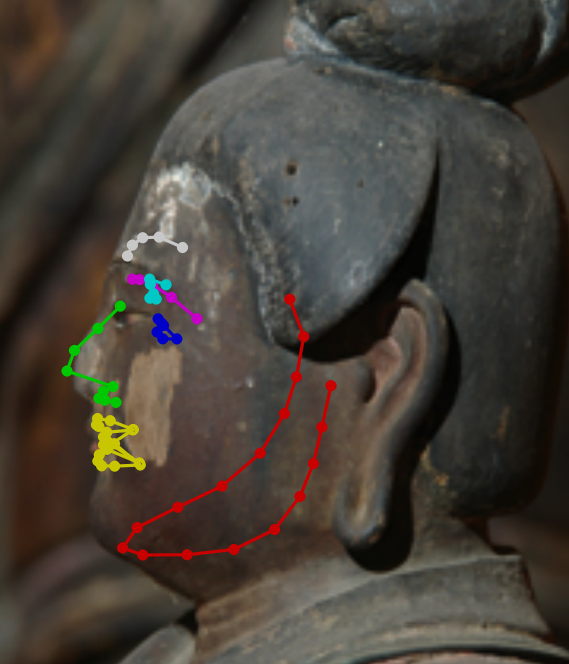

Buddha faces annotation 2
=========================

Purpose
=======

This annotation aims to refine already existing facial landmarks, and propose accurate per image 2D annotations.\
You will be provided an application modified by Hugo to refine the landmarks that were previously annotated for another task.

Set up
======

You will find the project in a Google Drive folder at this link:

https://drive.google.com/drive/folders/1Zz4YJfn-WtoTnjCfWkFR4U6e9q7yckBs?usp=sharing

Please download the project buddha_faces_annotation2 folder on your computer and copy it wherever you want (Desktop, 
Download, Documents, etc). \
Double-click on it once it’s downloaded. You will find a file "data.zip", right click on it and select "Extract here". 
(double-click for MacOSX users)\
While it's downloading, please take a look at the folder with your name in the Google Drive, next to the "Shards tracking" file.
It will be used for you to send your annotations.

Then depending on your Operating System:

-   For Windows:
        
    a.  Double-click the file "WINDOWSlabelme.bat"
        
    b.  You might be asked to press [y] and Enter a couple of times
        the first time you open the project, please do so

-   For MacOSX:
    
    0.  Grant all permissions on the folder "buddha_faces_annotation2"
    
    a.  Double-click the "MACOSXlabelme.command"
    
    b.  You might be asked to press [y] and Enter a couple of times the
        first time you open the project, please do so

-   For Linux (Ubuntu, Debian, etc…):

    a.  Right click inside the folder and click “Open in Terminal”
    
    b.  Copy or type: ./LINUXlabelme.sh
        
    c.  Then press Enter
        
    d.  You might be asked to press [y] and Enter a couple of times
            the first time you open the project, please do so

When everything is finished you should have this window opened (don’t
hesitate to make it in full screen):

You are now ready to start the annotation.

Getting started
===============

To start annotating click “Open Dir” button, a dialogue window will
appear where the data is located. Here the folders are named
“shardXX”. They contain 100 artifacts each. When you start annotating
a new shard please select your name/id/pseudo in the corresponding
column on the Google Sheets file called “Shards tracking2”:

https://drive.google.com/drive/folders/1Zz4YJfn-WtoTnjCfWkFR4U6e9q7yckBs?usp=sharing

Do not annotate a shard already started by another annotator.

Once you have a new shard at your name browse in that folder and
select any folder inside, they will be named “artifact_XXXX”.

Click “Select folder” when you have selected the desired artifact.udate 

Navigate through the images of the artifact by clicking on their name in the "File List" box in the bottom right corner:

Then the previous estimation of landmarks will appear:

Now go to any picture and click on any point. Maintaining the click will allow you to move that point freely.\
You can do the same with an entire shape if you select the colored area between the points.\
You will not be asked to create any new points, the task here is about giving the perfect location of the visible 
points of each picture.\
The modifications will NOT be reported to the other views. You will need to correct the points in every view to 
have the correct 2D annotation.

You can zoom in and out the image maintaining "Ctrl" and using the scroll wheel of the mouse.

Finishing an artifact and a shard
=================================

When all the images of an artifact are annotated, repeat the steps to “Open Dir” for the next artifact in your 
current shard.
Before quiting the application, change briefly the displayed image to save your last modifications.

When all the artifacts of a shard are annotated go to the directory of the project, then drag and drop the folder 
named "annotations2" shard in Google Drive, inside the folder you created with your name. 
(https://drive.google.com/drive/folders/1Zz4YJfn-WtoTnjCfWkFR4U6e9q7yckBs?usp=sharing).

Then get a new shard at your name.

Thank you for your implication 😃

Hugo
